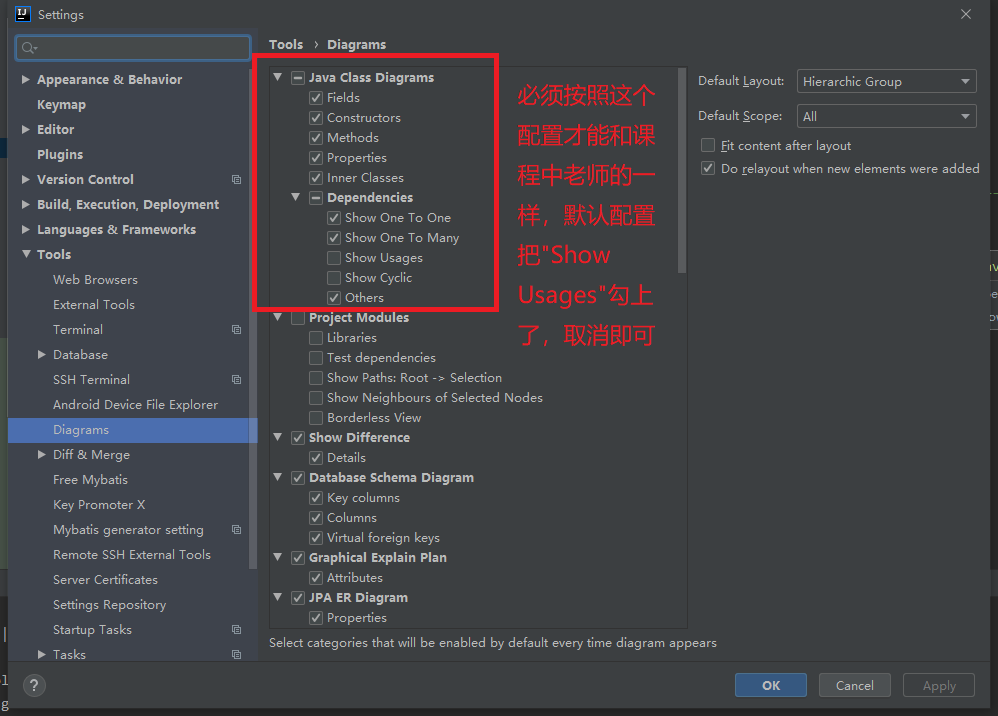
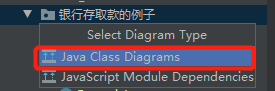
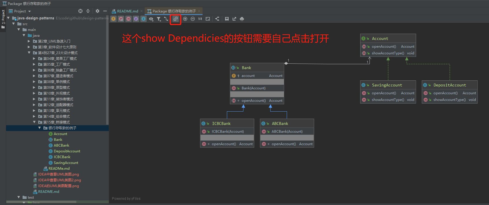
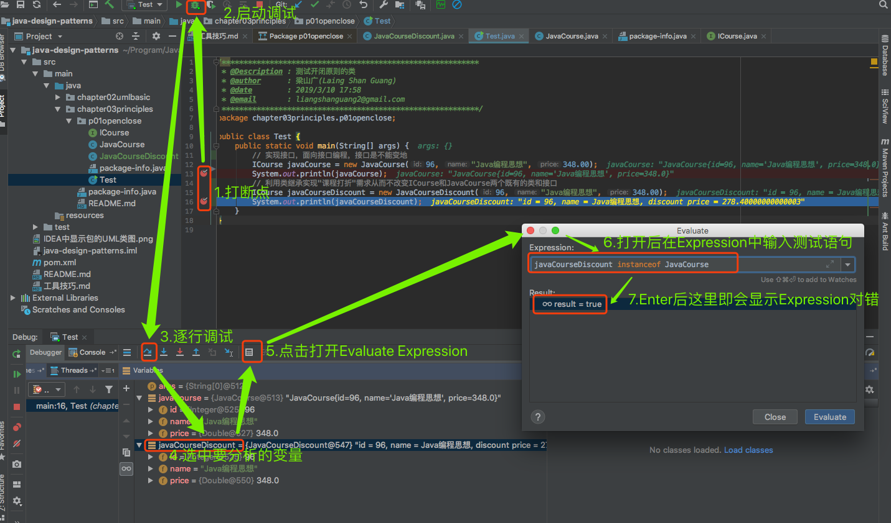
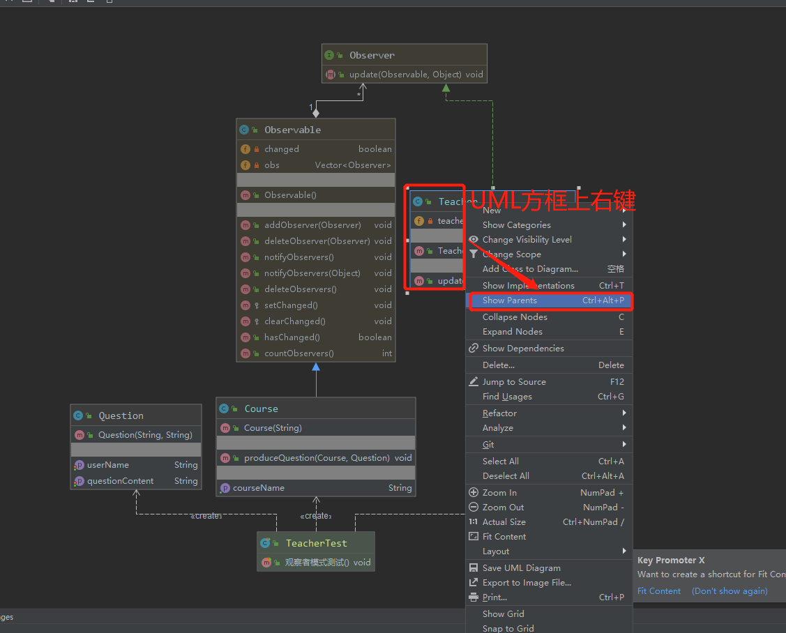

# 设计模式课程中学到的IDEA使用技巧
> 非常实用，尤其是查看类图、类关系、多线程调试等

## IDEA的UML类图配置和查看
### 配置
> 勾选向

### 查看包的类图
+ 包名上右键-->接近最下方有个Diagrams-->Show Diagram
  > 
+ 然后选择`Java Class Diagrams` 
  > 
+ 然后在打开的Java类图中打开"Show Dependencies"按钮，如下图，到此才能和课程中老师展示地完全一样
  > 

## IDEA中的常用快捷键
+ 查找接口的实现类： `Ctrl + alt +B`
+ 再按F2查看详细文档注解 
+ 查看包的UML类图：`Ctrl + Alt + Shift + u`
+ 搜索类：`Ctrl + Shift + t`
+ 查看代码的结构：`Ctrl + o`:
+ 查看实现类：`Ctrl + t`

## IDEA中调试变量

## 在UML中中剔除Test代码

## 在UML类图中查看没有显示地父类

## 调试多线程

> 见具体的总结[基于懒汉式单例模式的不同实现演示IDEA中多线程的调试](src/main/java/第4到27章_23大设计模式/第08章_单例模式/懒汉式/基于懒汉式单例模式的不同实现演示IDEA中多线程的调试.md)

