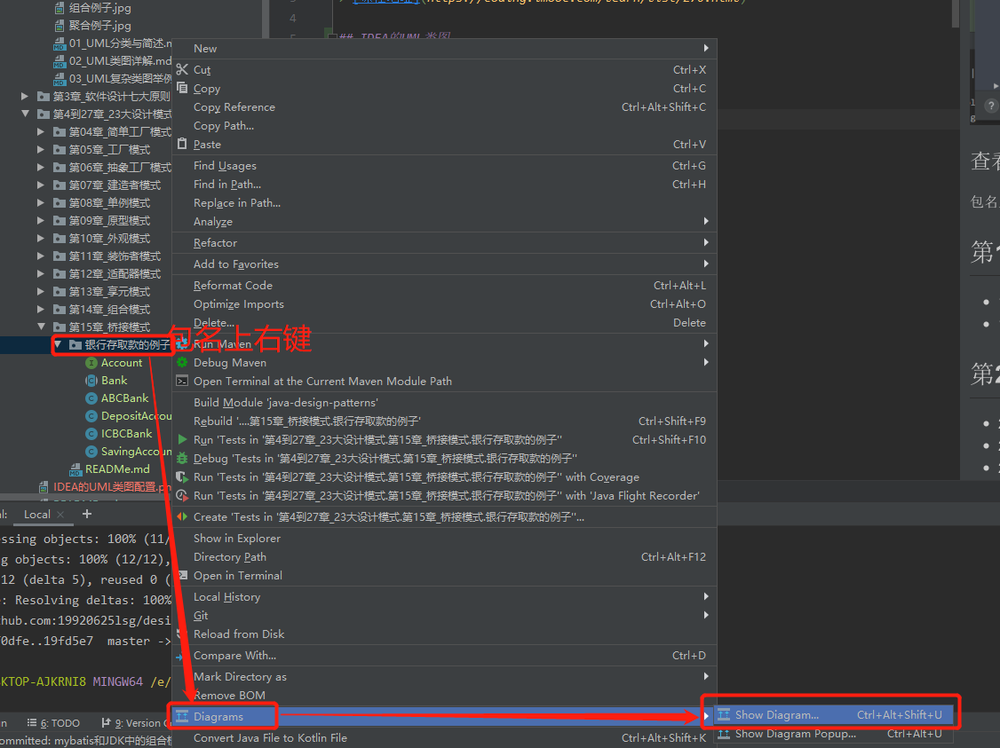

# Java设计模式精讲-Debug方式+内存分析

> [课程地址](https://coding.imooc.com/learn/list/270.html)

## IDEA的UML类图
### 配置
> 勾选向

### 查看包的类图
+ 包名上右键-->接近最下方有个Diagrams-->Show Diagram
  > 
+ 然后选择`Java Class Diagrams` 
  > 
+ 然后在打开的Java类图中打开"Show Dependencies"按钮，如下图，到此才能和课程中老师展示地完全一样
  > 

## 第1章 课程导学

+ 1-1 课前必读（不看会错过一个亿）
+ 1-2 课程导学  (07:18)

## 第2章 UML急速入门

+ 2-1 本章导航  (14:39)
+ 2-2 UML类图讲解  (04:23)
+ 2-3 UML类图讲解-自上而下  (08:48)
+ 2-4 UML类图讲解-对比讲解联想记忆  (06:02)

## 第3章 软件设计七大原则

+ 3-1 本章导航  (02:09)
+ 3-2 开闭原则讲解  (02:58)
+ 3-3 开闭原则coding  (17:35)
+ 3-4 依赖倒置原则讲解+coding  (16:28)
+ 3-5 单一职责原则讲解  (02:54)
+ 3-6 单一职责原则coding  (13:58)
+ 3-7 接口隔离原则讲解+coding  (09:08)
+ 3-8 迪米特法则讲解+coding  (11:51)
+ 3-9 里氏替换原则讲解  (14:08)
+ 3-10 里氏替换原则coding  (22:49)
+ 3-11 合成复用原则讲解+coding  (13:16)

## 第4章 简单工厂讲解+Coding+源码解析

+ 4-1 简单工厂讲解  (03:41)
+ 4-2 简单工厂coding  (14:52)
+ 4-3 简单工厂JDK源码解析  (09:50)

## 第5章 工厂方法模式讲解+Coding+源码解析

+ 5-1 工厂方法讲解  (05:46)
+ 5-2 工厂方法coding  (14:22)
+ 5-3 工厂方法源码解析(jdk+logback)  (09:58)

## 第6章 抽象工厂模式讲解+Coding+源码解析

+ 6-1 抽象工厂讲解  (07:23)
+ 6-2 抽象工厂coding  (17:25)
+ 6-3 抽象工厂源码解析  (06:05)

## 第7章 建造者模式讲解+Coding+源码解析

+ 7-1 建造者模式讲解  (03:54)
+ 7-2 建造者模式coding  (24:04)
+ 7-3 建造者模式源码解析(jdk+guava+spring+mybatis)  (08:41)

## 第8章 单例模式讲解+Coding+源码解析

+ 8-1 单例模式讲解  (07:18)
+ 8-2 单例设计模式-懒汉式及多线程Debug实战  (16:10)
+ 8-3 单例设计模式-DoubleCheck双重检查实战及原理解析  (12:47)
+ 8-4 单例设计模式-静态内部类-基于类初始化的延迟加载解决方案及原理解析  (07:23)
+ 8-5 单例设计模式-饿汉式  (03:59)
+ 8-6 单例设计模式-序列化破坏单例模式原理解析及解决方案  (15:18)
+ 8-7 单例设计模式-反射攻击解决方案及原理分析  (19:08)
+ 8-8 单例设计模式-Enum枚举单例、原理源码解析以及反编译实战  (15:14)
+ 8-9 单例设计模式-容器单例  (09:33)
+ 8-10 单例设计模式-ThreadLocal线程单例  (04:44)
+ 8-11 单例模式源码分析(jdk+spring+mybatis)  (06:09)

## 第9章 原型模式讲解+Coding+源码解析

+ 9-1 原型模式讲解  (04:27)
+ 9-2 原型模式coding  (23:13)
+ 9-3 原型模式coding-克隆破坏单例  (04:42)
+ 9-4 原型模式源码解析  (05:05)

## 第10章 外观模式讲解+Coding+源码解析

+ 10-1 外观模式讲解  (04:01)
+ 10-2 外观模式coding  (15:25)
+ 10-3 外观模式源码解析(springjdbc+myabtis+tomcat)  (07:56)

## 第11章 装饰者模式讲解+Coding+源码解析

+ 11-1 装饰者模式讲解  (06:35)
+ 11-2 装饰者模式coding  (14:58)
+ 11-3 装饰者模式源码解析(spring-session mybatis jdk servlet)  (12:34)

## 第12章 适配器模式讲解+Coding+源码解析

+ 12-1 适配器模式讲解  (04:20)
+ 12-2 适配器模式coding  (12:35)
+ 12-3 适配器模式源码解析(jdk+spring+springjpa+springmvc)  (10:19)

## 第13章 享元模式讲解+Coding+源码解析

+ 13-1 享元模式讲解  (06:38)
+ 13-2 享元设计模式coding  (13:34)
+ 13-3 享元模式源码解析(jdk+tomcat)  (06:27)

## 第14章 组合模式讲解+Coding+源码解析

+ 14-1 组合模式讲解  (04:02)
+ 14-2 组合模式coding  (17:35)
+ 14-3 组合模式源码解析(jdk+mybatis)  (07:14)

## 第15章 桥接模式讲解+Coding+源码解析

+ 15-1 桥接模式讲解  (06:30)
+ 15-2 桥接模式coding  (19:32)
+ 15-3 桥接模式源码解析(jdk)  (06:20)

## 第16章 代理模式讲解+Coding+源码解析

+ 16-1 代理模式讲解  (10:28)
+ 16-2 代理模式coding-静态代理-1  (14:35)
+ 16-3 代理模式coding-静态代理-2  (10:25)
+ 16-4 代理模式coding-动态代理  (21:27)
+ 16-5 代理模式源码解析(jdk+spring+mybatis)  (06:24)

## 第17章 模板方法模式讲解+Coding+源码解析

+ 17-1 模板方法模式讲解  (06:02)
+ 17-2 模板方法模式coding  (16:07)
+ 17-3 模板方法源码解析(jdk+servlet+mybatis)  (05:49)

## 第18章 迭代器模式讲解+源码解析

+ 18-1 迭代器模式讲解  (03:17)
+ 18-2 迭代器模式coding  (07:43)
+ 18-3 迭代器模式源码解析(jdk+mybatis)  (03:05)

## 第19章 策略模式讲解+Coding+源码解析

+ 19-1 策略模式讲解  (06:40)
+ 19-2 策略模式coding  (17:32)
+ 19-3 策略模式源码解析(jdk+spring)  (05:49)

## 第20章 解释器模式讲解+源码解析

+ 20-1 解释器模式讲解  (03:35)
+ 20-2 解释器模式coding  (14:26)
+ 20-3 解释器源码解析-jdk+spring  (03:11)

## 第21章 观察者模式讲解+Coding+源码解析

+ 21-1 观察者模式讲解  (03:42)
+ 21-2 观察者模式coding  (13:46)
+ 21-3 观察者模式源码解析-jdk-guava  (07:39)

## 第22章 备忘录模式讲解+源码解析

+ 22-1 备忘录模式讲解  (02:55)
+ 22-2 备忘录模式coding  (11:46)
+ 22-3 备忘录模式源码解析-spring  (03:41)

## 第23章 命令模式讲解+Coding+源码解析

+ 23-1 命令模式讲解  (03:39)
+ 23-2 命令模式coding  (10:51)
+ 23-3 命令模式源码-jdk-junit  (02:43)

## 第24章 中介者模式讲解+源码解析

+ 24-1 中介者模式讲解  (03:20)
+ 24-2 中介者模式coding  (04:19)
+ 24-3 中介者源码-jdk  (02:08)

## 第25章 责任链模式讲解+Coding+源码解析

+ 25-1 责任链模式讲解  (03:00)
+ 25-2 责任链模式coding  (13:10)
+ 25-3 责任链模式源码-servlet  (03:14)

## 第26章 访问者模式讲解+源码解析

+ 26-1 访问者模式讲解  (03:23)
+ 26-2 访问者模式coding  (09:11)
+ 26-3 访问者模式源码-jdk-spring  (02:44)

## 第27章 状态模式讲解+Coding+源码解析

+ 27-1 状态模式讲解  (03:49)
+ 27-2 状态模式coding  (16:24)
+ 27-3 状态模式源码-JSF  (02:05)

## 第28章 课程总结