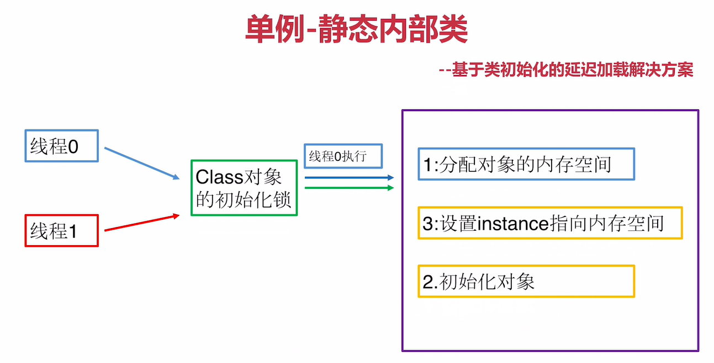

# 单例模式

## 定义
> 保证一个类仅有一个实例，并提供一个全局访问点

## 类型
> 创建型

## 适用场景
> 想确保任何情况下都绝对只有一个实例，比如数据库连接和线程池等

## 优点
+ 在内存中只有一个实例，减少了内存开销
+ 可以避免对资源的多重占用
+ 设置全局访问点，严格控制访问

## 缺点
> 没有接口，扩展困难

## 重点
+ `私有构造器`
+ `线程安全`
+ `延迟加载`(使用时创建，这种创建单例的方式一般叫`懒汉式`)
+ `序列化和反序列化`会破坏单例模式，如何避免
+ 反射也可以破坏单例模式，如何防御`反射攻击`

## 单例模式的常见实现方式
### 懒汉式(用到时才创建)
#### 1.Double Check(使用volatile防止指令重排序的双重检查机制)
> 不加volatile会有指令重排序问题,加volatile可以禁止指令重排序
单线程下没问题

多线程中会访问到一片随机的内存区域


#### 2.静态内部类
> 原理是静态内部类存在"类初始化锁"，等效于synchronized,同一时间只能有一个线程拿到锁

```java
public class SingletonLazy {
    /**
     * private的静态内部类可以保证其他类看不到InnerClass中的单例实例化过程，即使里面发生指令重排序外面也是不可见地
     * <p>
     * 原理是静态内部类存在"类初始化锁"，等效于synchronized,同一时间只能有一个线程拿到锁
     * <p>
     * 类初始化的几种情况(都会产生类初始锁)：
     * 1、类实例被创建
     * 2、类中声明的静态方法被调用
     * 3、类中声明的静态成员被赋值
     * 4、类中声明的静态成员被使用且静态成员不是常量（即不被final修饰）
     * 5、类是顶级类，类中有断言语句
     * 前4种经常见，第5种较为少见
     */
    private static class InnerClass {
        private static SingletonLazy singletonLazy = new SingletonLazy();
    }

    public static SingletonLazy getInstance() {
        return InnerClass.singletonLazy;
    }

    /**
     * 构造器必须是私有地，防止外部创建类实例
     */
    private SingletonLazy() {

    }
}
```


## 实用技能
+ 反编译
+ 内存原理
+ 多线程Debug

## 和单例模式经常结合使用的设计模式
+ 工厂模式
+ 享元模式