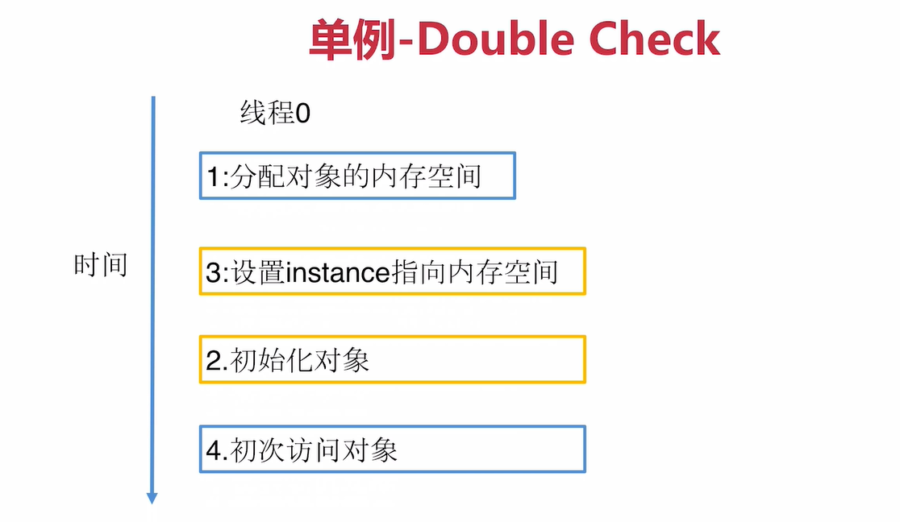
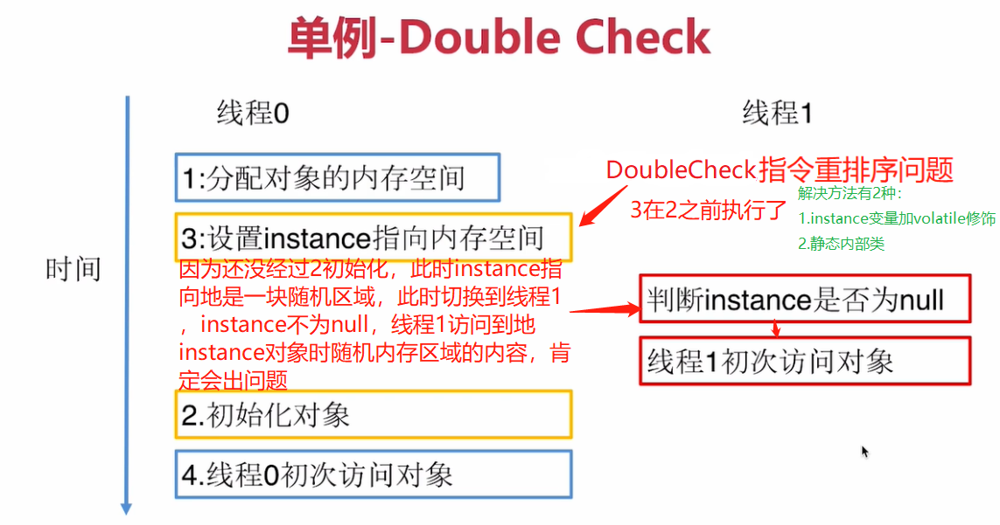

# 单例模式

## 定义
> 保证一个类仅有一个实例，并提供一个全局访问点

## 类型
> 创建型

## 适用场景
> 想确保任何情况下都绝对只有一个实例，比如数据库连接和线程池等

## 优点
+ 在内存中只有一个实例，减少了内存开销
+ 可以避免对资源的多重占用
+ 设置全局访问点，严格控制访问

## 缺点
> 没有接口，扩展困难

## 重点
+ `私有构造器`
+ `线程安全`
+ `延迟加载`(使用时创建，这种创建单例的方式一般叫`懒汉式`)
+ `序列化和反序列化`会破坏单例模式，如何避免
+ 反射也可以破坏单例模式，如何防御`反射攻击`

## 单例模式的常见实现方式
### 1.懒汉式(用到时才创建)：Double Check(防止指令重排序的双重检查机制)
> 不加volatile会有指令重排序问题
单线程下没问题

多线程中会访问到一片随机的内存区域

### 2.饿汉式(一开始就随着类创建)：静态内部类

## 实用技能
+ 反编译
+ 内存原理
+ 多线程Debug

## 和单例模式经常结合使用的设计模式
+ 工厂模式
+ 享元模式