# IDEA中多线程的调试
## 要点
> 1.主要是在设置断点后，要在断点上右击，选择Thread模式


> 2.并在调试的时候通过在Frames界面切换不同的线程来龙之多线程的逻辑


## 实战1：不安全的懒汉式单例模式演示

### 1.打好Thread模式的断点
+ [Thread断点1代码地址](../../../../../../src/test/java/第4到27章_23大设计模式/第08章_单例模式/懒汉式/V1线程不安全的实现/SingletonLazyTest.java)
  > 

+ [Thread断点2代码地址](../../../../../../src/test/java/第4到27章_23大设计模式/第08章_单例模式/懒汉式/V1线程不安全的实现/SingletonLazyTest.java)
  > 

+ [Thread断点3代码地址](V1线程不安全的实现/SingletonLazy.java)
  > 

### 2.模拟线程不安全的场景
> 即单例模式在不同线程中返回不同的实例，违反了单例模式的要求
+ 1.开启调试
  > 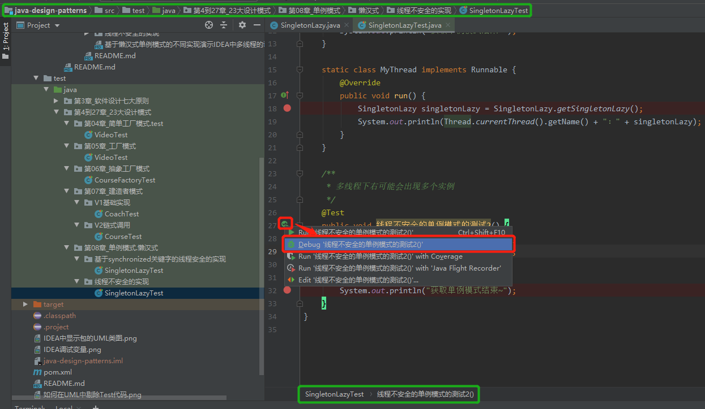
+ 2.在Debug界面的Frames中切换到线程0
  > 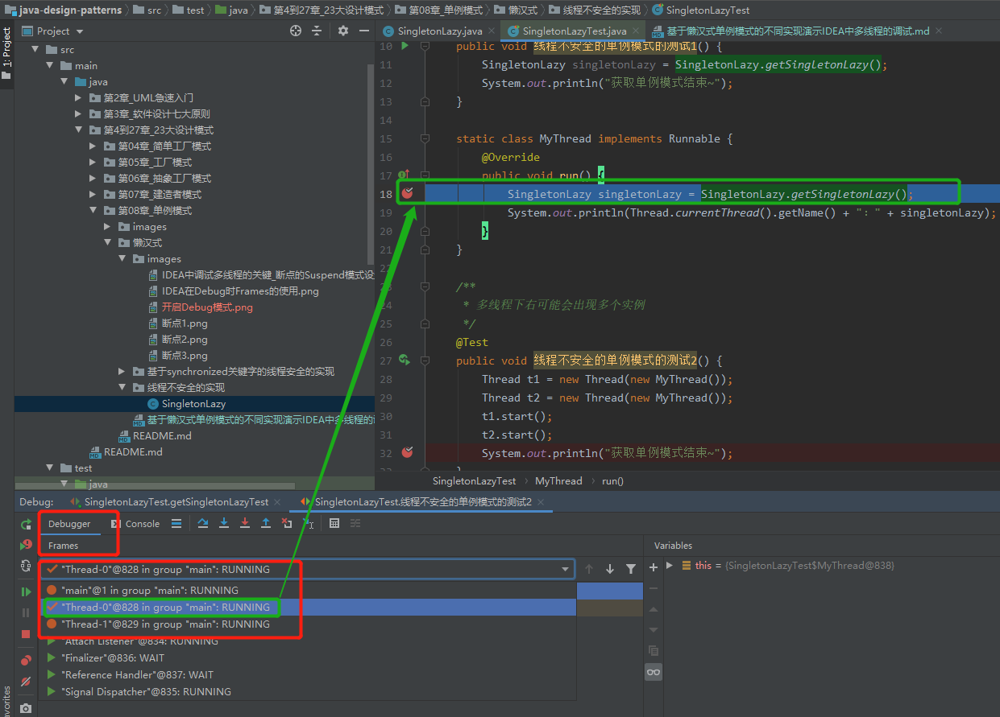
+ 3.线程0`逐步调试(Step Over，F6是其快捷键)`走到判空的内部
  > 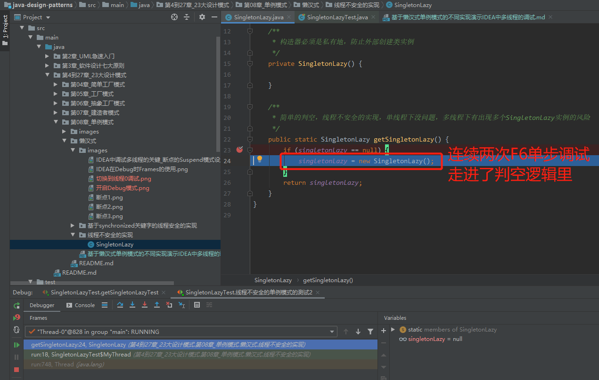
+ 4.切换到1，通线程0一样两次F6单步调试走进判空逻辑
  > 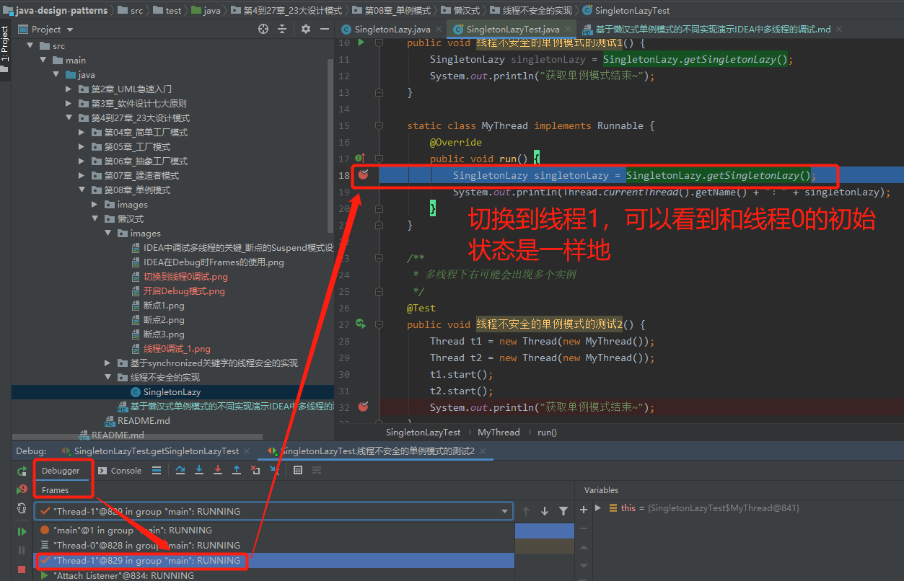
  > 两次单步调试走进了判空逻辑
  > 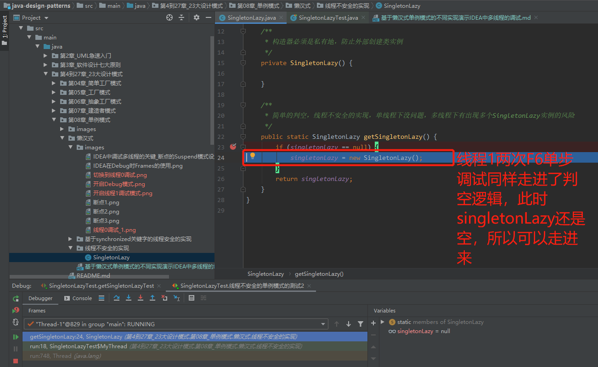
+ 5.切回线程0，把线程0走完，可以看到返回的singletonLazy对象是`singletonLazy@842`
  > 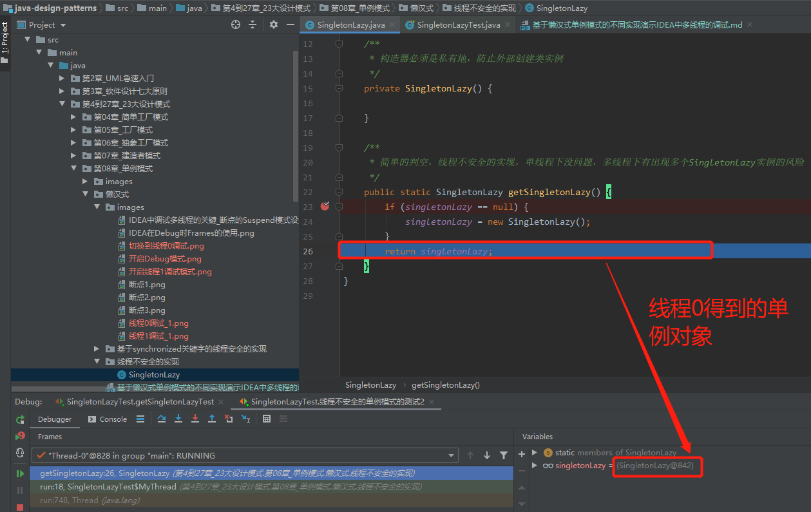
  > 控制台的打印输出为：
  > 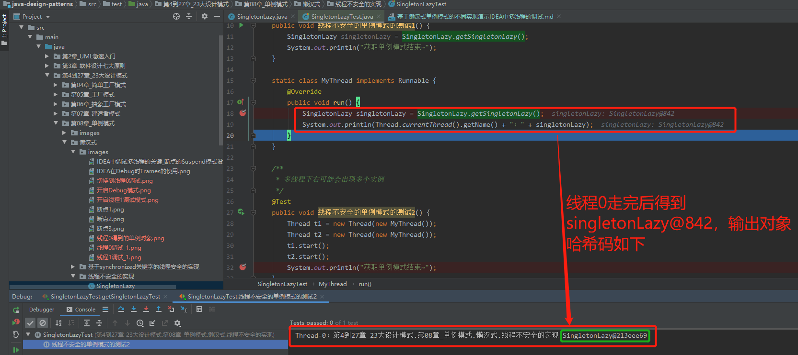
+ 6.再切回线程1，把线程1走完，可以看到返回的singletonLazy对象是`singletonLazy@843`
  > 即单例中不同的线程得到了不同的实例对象，现在的单例实现是不可信地
  > 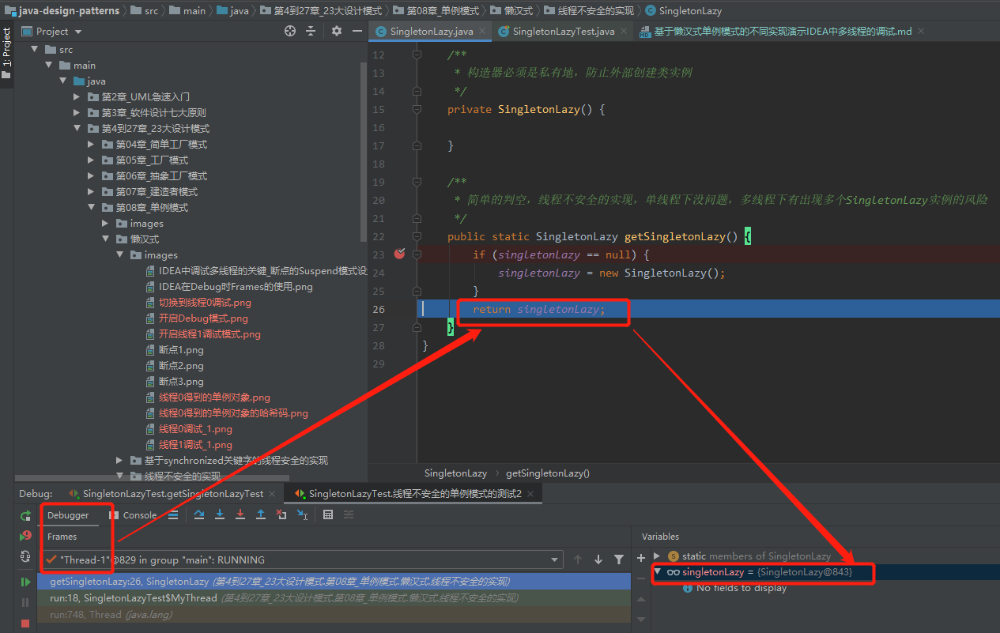
  > 线程1最后的哈希码
  > 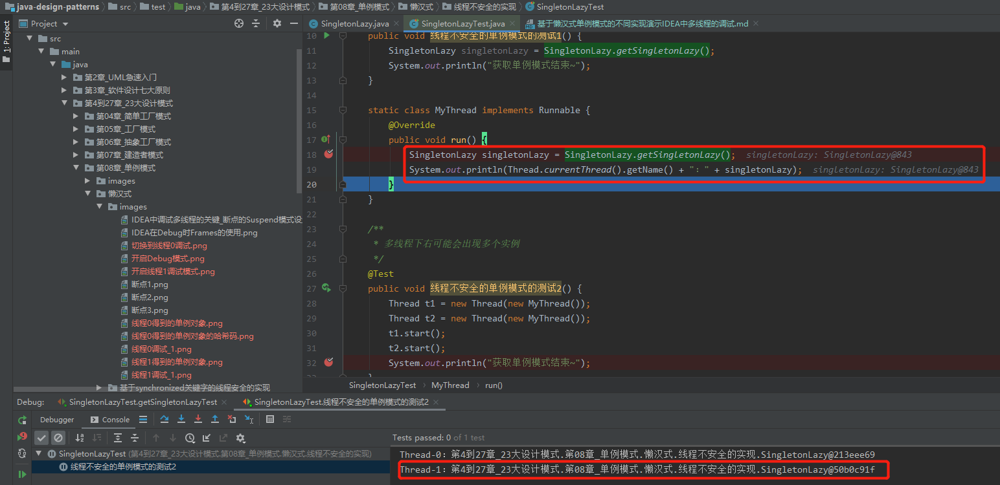

## 实战2：通过synchronized加在getSingletonLazy实现了安全的单例模式
### 1.关键函数上加synchronized
> 这种模式等效于`synchronized(SingletonLazy.class)`，虽然简单，但是锁的范围太大，会影响性能
```java
/**
 * 简单的判空，线程不安全的实现，单线程下没问题，多线程下有出现多个SingletonLazy实例的风险
 *
 * synchronized加在static方法上是加在类上，等效于synchronized(SingletonLazy.class)，即
 * synchronized (SingletonLazy.class) {
 *     if (singletonLazy == null) {
 *         singletonLazy = new SingletonLazy();
 *     }
 * }
 */
public synchronized static SingletonLazy getSingletonLazy() {
    if (singletonLazy == null) {
        singletonLazy = new SingletonLazy();
    }
    return singletonLazy;
}
```
### 2.和上面不安全的线程调试打一样位置的断点
### 3.开启调试
+ 1.在[SingletonLazyTest](../../../../../../src/test/java/第4到27章_23大设计模式/第08章_单例模式/懒汉式/V2基于synchronized关键字的线程安全的实现/SingletonLazyTest.java)开启debug模式
  > 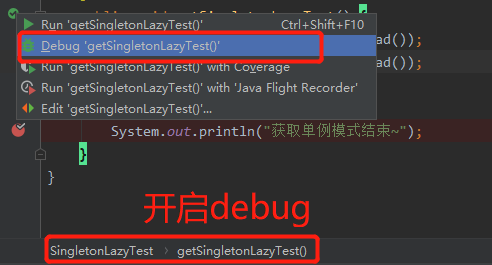
+ 2.切换到线程0，并两次F6单步调试走进synchronized函数修饰的getSingletonLazy函数
  > 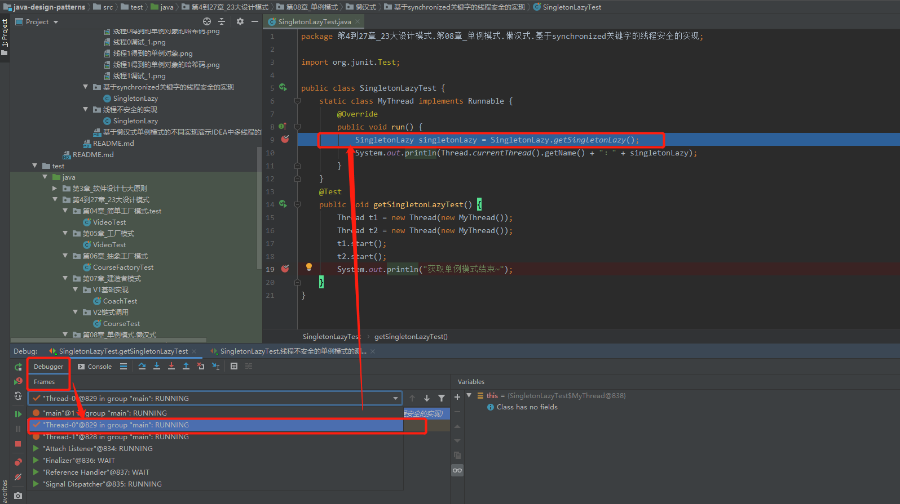
  > 两次F6走进synchronized函数修饰的getSingletonLazy函数
  > 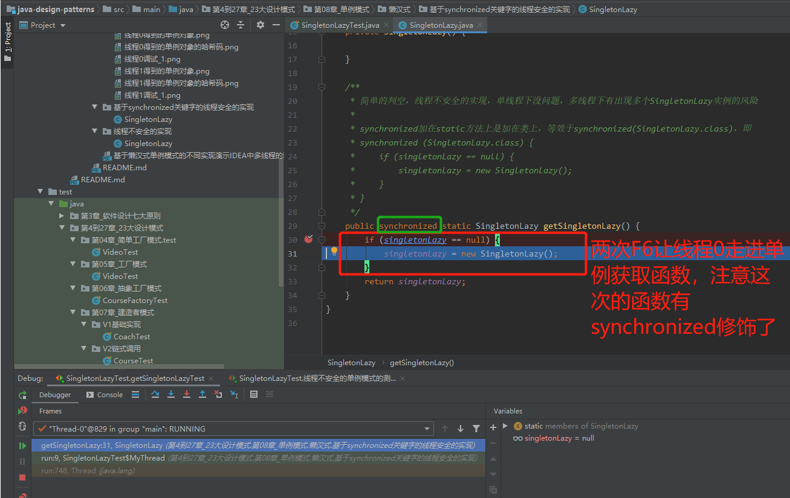
+ 3.切到线程1，会看到线程1处于Monitor模式，即阻塞模式，synchronized函数修饰的getSingletonLazy函数被线程0拿到锁了，线程1无法进入，把线程0走完让线程1拿到锁才能让线程1运行
  > 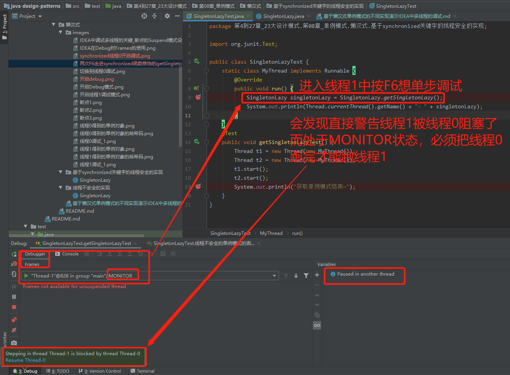
+ 4.把线程0走完，在切回线程1，线程1可以正常运行，因为线程0走完单例已经实例化完成，进入线程1后判空逻辑进不去，直接返回线程0创建的单例对象了，从而保证了单例的正确性
  > 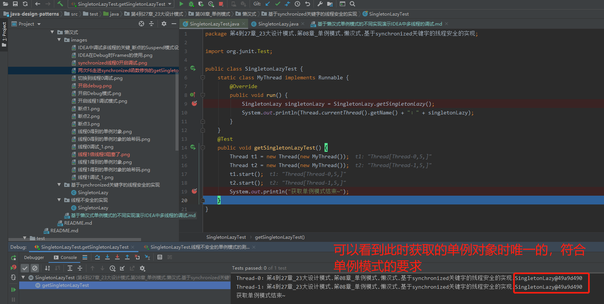