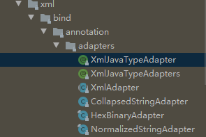

# 第12章 适配器模式(adaptor)
> 简单说就是在使用和维护阶段，在不修改现有代码的前提下通过`组合`、`继承extends`、`实现implements`等方式完成新的需求。优先选用组合

## 定义
+ 将一个类的接口转换成客户期望的另一个接口
+ 使原本接口不兼容的类可以一起工作
+ 类型：结构型

## 适用场景
+ 已经存在的类，它的方法和需求不匹配时(方法结果相同或相似)
+ 不是软件设计阶段考虑的设计模式，是随着软件维护，由于不同产品、不同厂家造成功能类似而接口不相同情况下的解决方案

## 优点
+ 提高类的透明性和复用，现有的类复用但不需要改变
+ 目标类和适配器类解耦，提高程序扩展性
+ 符合开闭原则

## 缺点
+ 适配器编写过程中需要全面考虑，可能会增加系统的复杂性
+ 增加系统代码可读的难度

## 扩展
+ 对象适配器
+ 类适配器

## 相关设计模式
+ 适配器模式与外观模式：都是对现有的类进行封装
  + 外观模式定义新的接口（提供更为方便的访问入口），适配器模式复用原有的接口（使已有的两个接口协同工作）
  + 如果将外观模式看做适配器模式：两者之间的是适配程度不一致，外观模式适配整个子系统，外观模式针对的对象力度更大
  
## 类适配器和对象适配器的区别
+ [类适配器模式](E1类适配器)：通过类继承获取被继承者的方法
+ [对象适配器模式](E2对象适配器)：通过组合方式，把具体实现Target的request方法委托给adaptee来实现

## 应用
+ JDK中：`javax.xml.bind.annotation.adapters`包下面的所有类
  > 
+ Spring中：`org.springframework.aop.framework.adapter`包下面的所有类
+ JPA中：`org.springframework.orm.jpa.JpaVendorAdapter`
+ SpringMVC中：`org.springframework.web.servlet.HandlerAdapter`
