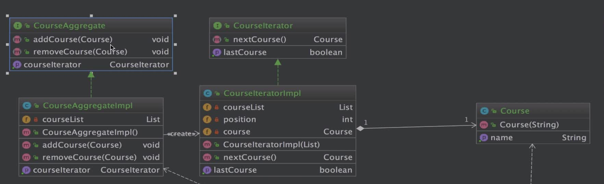

# 第18章 迭代器模式(Iterator)

## 定义
+ 提供一种方法，顺序访问一个集合对象中的各个元素，而又不暴露该对象的内部表示
+ 类型：行为型

## 适用场景
+ 访问一个集合对象的内容而无需暴露它的内部表示
+ 为遍历不同的集合结构提供一个统一的接口

## 优点
+ 分离了集合对象的遍历行为

## 缺点
+ 类的个数成对增加

## 相关设计模式
+ 迭代器模式和访问者模式
  + 相同点：都是迭代地访问一个集合中的元素
  + 不同点：访问者模式扩展开放的部分作用在集合对象的操作上；迭代器模式扩展开放的部分作用在集合对象的种类上

## 迭代器虽然应用很广但是我们一般都是直接使用，此处不再讲源码了

## 应用
+ JDK:`java.util.iterator`
+ MYBatis:`org.apache.ibatis.cursor.defaults.DefaultCursor`